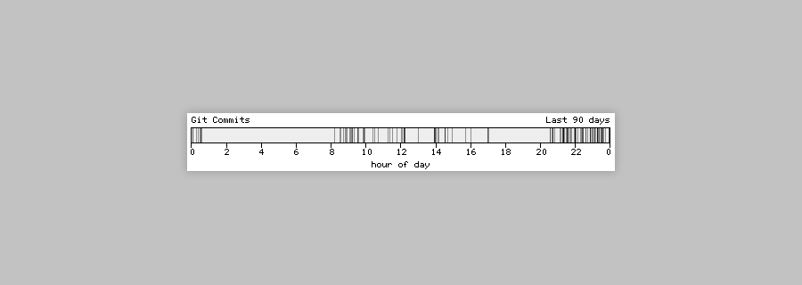

# Blogtimes Eleventy Plugin

Blogtimes is a plugin for the [Eleventy](https://github.com/11ty/eleventy) static site generator, written in JavaScript.
Given a directory with a valid git repository it will generate a histogram of commit times over 24 hours defaulting to
within the past 30 days.

It's a direct port from PHP of
the [WordPress plugin Blogtimes](https://photogabble.co.uk/noteworthy/blogtimes-a-trip-down-memory-lane/), which was
itself ported to WordPress by Matt Mullenweg from b2 in 2003.

Here is a screenshot of what its output looks like:


## Why?

I have been building websites and blogging since 1999, starting with hand coded html in notepad, I quickly picked up b2
and soon after WordPress. Around that time I was an avid subscriber to Matt's blog and so when they shared their port of
Blogtimes for WordPress (I believe it was the second WordPress plugin,) I immediately gave it a go.

For a number of years, every so often I would remember that histogram but not where it came from. In 2019 I began
researching and in 2022 I finally published what I had found
in [Blogtimes: A trip down memory lane](https://photogabble.co.uk/noteworthy/blogtimes-a-trip-down-memory-lane/). In
January of 2023 [Mike Little's post on Mastodon](https://notacult.social/@mikelittle@mastodon.online/109750328046847753)
reminded me of this whole escapade and I decided to port the plugin to Eleventy.

18 years ago Matt ported it to WordPress from Sanjay Sheth's b2 version, I have continued that tradition by porting it
to JavaScript for use with Eleventy. Long may it continue to be used and toyed with - code is poetry.

You
can [browse the WordPress versions source over at their trac service](https://plugins.trac.wordpress.org/browser/blogtimes/)
.

## Install

```
npm i @photogabble/eleventy-plugin-blogtimes
```

## Configuration

```ts
type EleventyPluginBlogtimesOptions = {
  width?: number, // Image Width, default: 480
  height?: number, // Image Height, default: 80
  title?: string, // Title output top left, default: 'Git Commits'
  lastXDays?: number, // Time period in days, default: 30
  hPadding?: number, // Padding top and bottom, default: 5
  vPadding?: number, // Padding left and right, default: 5
  showTicks?: boolean, // Show ticks, default: true
  unitName?: string, // Units, displayed centered at bottom, default: 'hour of day'

  outputFileExtension: string, // Image mimetype, default: 'png, must be either png or jpg
  outputDir: string, // Image output directory, default: 'bt-images'
  urlPath: string, // Image url path, default: 'bt-images'
  hashLength?: number; // Image filename hash length, default: 10
}
```

## Usage

In your Eleventy config file (defaults to `.eleventy.js`):

```js
module.exports = (eleventyConfig) => {
  eleventyConfig.addPlugin(require('@photogabble/eleventy-plugin-blogtimes'),{
    src: './',
    dist: './img/'
  });
};
```

You will now be able to use the `blogtimes` shortcode in your templates:

```nunjucks
{{ blogtimes }}
```

By default, blogtimes will process the git stats for the repository its run in. You can change that by passing an absolute path to the shortcode.

## Libraries in use

- [node canvas](https://www.npmjs.com/package/canvas)
- [bdf-canvas](https://www.npmjs.com/package/bdf-canvas)
- [git-log-parser](https://www.npmjs.com/package/git-log-parser)

## License

This 11ty plugin is open-sourced software licensed under the [MIT License](LICENSE). Also included in this repository
are [classic X Window System bitmap fonts](https://www.cl.cam.ac.uk/~mgk25/ucs-fonts.html) which are considered to
be [public domain](https://creativecommons.org/publicdomain/mark/1.0/).
